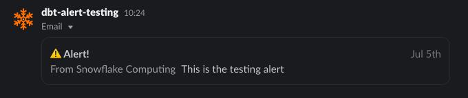

<!-- markdownlint-disable no-inline-html no-alt-text ul-indent code-block-style -->
# Getting Started with `dbt_alert` in Snowflake

It is recommended to check out the [Sending Email Notifications](https://docs.snowflake.com/en/user-guide/email-stored-procedures) in Snowflake.

Before we can utilize the package for [adding the first job](./adding-your-job.md), we need to set up the Integration objects using `ACCOUNTADMIN` role. This is the essential steps to let us prepare the stuff.

## [Optional] Create a Snowflake User

> UPDATE: It seems that we don't need this step anymore

We need an associated Snowflake User that holds the (Slack/MS Teams) Channel's email address.

Login to Snowflake using this new user's credential and get the email verification done!

Sample script for User creation:

```sql
use role securityadmin;
create or replace user user_email_alert with
  password='<hidden>'
  email = 'data_failure-hashingstringhere@sample.slack.com';
```

## Create the Notification Integration object

Make sure that the Notification Integration object gets created manually first using the `ACCOUNTADMIN` role.

Its script will be generated by `macros/resource/create_or_get_resource.sql` macro:

```bash
dbt run-operation create_or_get_resource --args '{create: true}'
```

<details>
  <summary>👉 Sample generated script</summary>
  
```sql
use role accountadmin;
create or replace notification integration ni_dbt_alert__dbt_alert_test__dev
  type = email
  allowed_recipients = ('channel-hashhashash@yourvalue.slack.com')
  enabled = true
  comment = "DEV Notification Integration object used for YOUR_DBT_PROJECT dbt project";
grant usage on integration ni_dbt_alert__dbt_alert_test__dev to role YOUR_PROFILE_ROLE;
```

</details>

## Send a test email

Switch to the `YOUR_PROFILE_ROLE` role and execute the `send_email` function:

```sql
use role <YOUR_PROFILE_ROLE>;
call system$send_email(
    '<YOUR_NOTIFICATION_INTEGRATION_NAME>',
    '<YOUR_CHANNEL_EMAIL>',
    '⚠️ Alert!', -- email title
    'This is the testing alert', -- email body
    'text/html'
);
```

Here is the sample result:



Now, you're ready to create the first job 🚀
