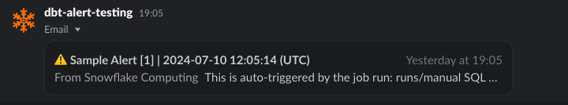
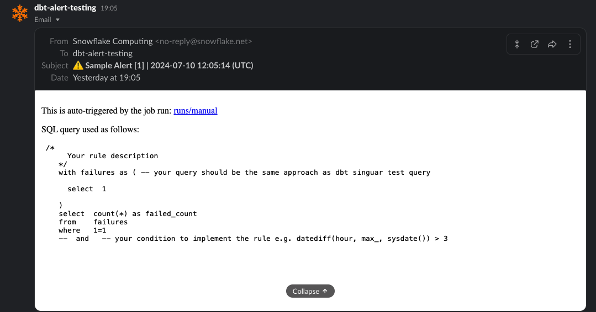

# How To Trigger Your Jobs

Let's add your jobs then utilize the package `dbt-alert` to trigger your jobs.

- [How To Trigger Your Jobs](#how-to-trigger-your-jobs)
  - [Adding Your Jobs](#adding-your-jobs)
    - [**Create a Job Macro:**](#create-a-job-macro)
    - [✍️ **Modify the `alert_query`:**](#️-modify-the-alert_query)
    - [✍️ **Customize the `alert_title`:**](#️-customize-the-alert_title)
    - [**Add your job name to `dbt_alert__jobs` variable**](#add-your-job-name-to-dbt_alert__jobs-variable)
  - [**Triggering Your Jobs**](#triggering-your-jobs)
    - [Using `run-operation`](#using-run-operation)
    - [Using `on-run-end` Hook](#using-on-run-end-hook)

## Adding Your Jobs

To set up a job that triggers alerts, follow these steps:

### **Create a Job Macro:**

Place your job macro under the `jobs/` directory.

The macro name **MUST** start with `dbt_alert_job__`. Eg: `jobs/dbt_alert_job__sample_1.sql`.

This macro will help return `alert_query` and `alert_title`

Sample of your macro:

```sql


    

        /*
          Your alert query to trigger alert
        */

    

    

    {{ return((alert_query, alert_title)) }}



```

📖 Check [integration_tests/macros/sample-jobs](https://github.com/infinitelambda/dbt-alert/tree/main/integration_tests/macros/sample-jobs) for your reference.

### ✍️ **Modify the `alert_query`:**

Inside the macro, set the `alert_query`. It should follow the same approach as the [dbt singuar test](https://docs.getdbt.com/docs/build/data-tests#singular-data-tests) query.

Sample script:

```sql

    /*
      Your rule description
    */
    with failures as ( -- your query should be the same approach as dbt singuar test query

        select  1

    )

    select
        count(*) as failed_count
    from failures
    where 1=1
        and   -- your condition to implement the rule e.g. datediff(hour, max_<timestamp>, sysdate()) > 3


```

### ✍️ **Customize the `alert_title`:**

Set the `alert_title` to a concise email subject for your alert.

Sample script:

```jinja
 {# your concise email title #}
```

### **Add your job name to `dbt_alert__jobs` variable**

In `dbt_project.yml` add name of alert job (exclude the prefix `dbt_alert_job__`) to variable `dbt_alert__jobs` so that macro `execute_jobs` can trigger the jobs that you expect.

For example:

```yml
vars:
  dbt_alert__jobs: "sample_1,sample_2"
```

## **Triggering Your Jobs**

The alert job can be executed using either the `run-operation` command or the `on-run-end` hook.

### Using `run-operation`

Run the following command to execute the alert job (replace `sample_1` with your actual job name):

```bash
  dbt run-operation execute_job --args '{"job_name": "sample_1"}'
  # or a dry run
  dbt run-operation execute_job --args '{"job_name": "sample_1", "dry_run": True}'
```

If you expect to execute **multiple jobs** (replace `sample_2, sample_3` with your actual job name):

```bash
  dbt run-operation execute_jobs --vars '{dbt_alert__jobs: "sample_2,sample_3"}'
  # or a dry run
  dbt run-operation execute_jobs --vars '{dbt_alert__jobs: "sample_2,sample_3"}' --args '{dry_run: true}'
```

### Using `on-run-end` Hook

For single alert job:

```yaml
  on-run-end:
    - "{{ dbt_alert.execute_job(job_name='sample_1') }}"
```

For multiple alert jobs:

```yaml
  vars:
    dbt_alert__jobs: "sample_2,sample_3"

  on-run-end:
    - "{{ dbt_alert.execute_jobs() }}"
```

Here is a **sample alert sent to a Slack channel**





In the above sample result, you might notice 2 minor useful things (which are built automatically):

- **Job metadata** will be added together with the configured Email Title e.g. `⚠️ Sample Alert [1] | 2024-07-10 12:05:14 (UTC)`
    - Configured Email Title = `⚠️ Sample Alert`
    - `Failed Count` = `[1]`
    - `Trigger At Timestamp` = `2024-07-10 12:05:14 (UTC)`
- **Run metadata** is enriched in the Email Body
    - `Run URL`: `run/{runid}` hyperlink will be the link to the dbt Cloud Run URL if you run the job over there
    - `Query Used`: Actual executed query run by the job

Happy dbt-ing and mindful alerting 🚀 💫
